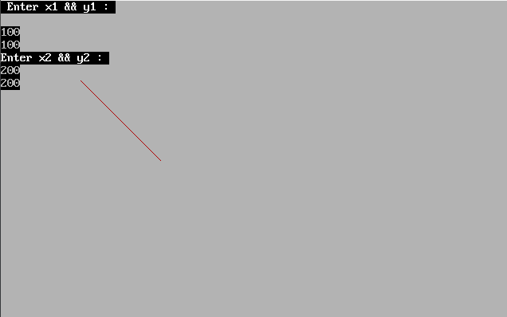

# Write a program to draw a line using DDA algorithm

## code 

```CPP
// Write a program to draw a line using DDA algorithm

#include <iostream.h>
#include <graphics.h>
#include <conio.h>
#include <stdlib.h>

void main()
{

    int gd = DETECT, gm;
    initgraph(&gd, &gm, "c:/turboc3/bgi");
    int x1, y1, x2, y2, dx, dy, steps;
    clrscr();
    cout << " Enter x1 && y1 : " << endl;
    cin >> x1 >> y1;
    cout << "Enter x2 && y2 : " << endl;
    cin >> x2 >> y2;

    dx = x2 - x1;
    dy = y2 - y1;

    if (abs(dx) > abs(dy))
    {
        steps = abs(dx);
    }
    else
    {
        steps = abs(dy);
    }
    putpixel(x1, y1, RED);

    int Xinc = float(steps / dx);
    int Yinc = float(steps / dy);

    for (int i = 0; i < steps; i++)
    {
        x1 = x1 + Xinc;
        y1 = y1 + Yinc;
        putpixel(x1, y1, RED);
    }
    getch();
    closegraph();
}


```


## Output

